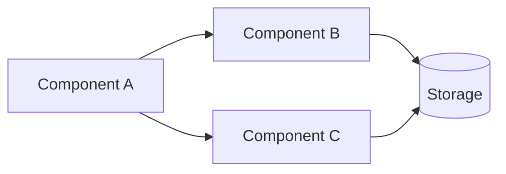
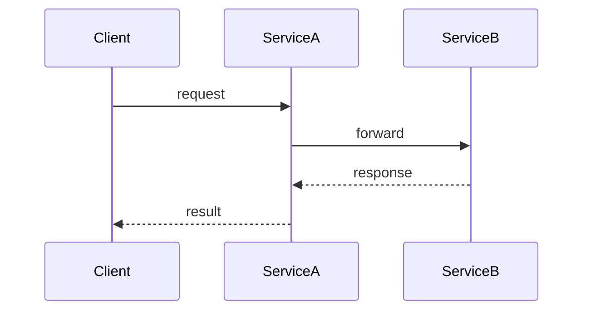

# Writing Documentation

## Overview

Project documentation lives in `docs/` and follows mkdocs conventions. Documentation focuses on concepts, data flows, and component relationships — not implementation code. The audience is developers who can read source code themselves.

**Core principle:** Documentation explains WHAT systems do and HOW they interact, referring to code objects by name without embedding code snippets.

**Violating the letter of these rules is violating the spirit of these rules.**

## When to Write or Update Documentation

- New major feature or system is implemented
- Core functionality changes behavior or architecture
- Data flow between components changes significantly
- New integrations or external dependencies are added
- Existing documented behavior is modified or removed

**Do NOT create documentation for:**

- Minor bug fixes or cosmetic changes
- Internal refactors that don't change behavior or interfaces
- Trivial configuration changes

## File Conventions

| Rule | Convention |
|------|-----------|
| Location | All documentation in `docs/` folder |
| Format | Markdown files (`.md`), mkdocs-compatible |
| Naming | `snake_case.md` (e.g., `zone_calculation.md`, `data_model.md`) |
| Organization | Topic-based subfolders (e.g., `docs/ai_agent/`, `docs/auth/`) |

## Folder Structure

```
docs/
├── index.md                    # Root: project overview + full table of contents
├── topic_name/
│   ├── index.md                # Topic overview + section table of contents
│   ├── architecture.md         # System design, data flow
│   ├── data_model.md           # Data structures, schemas
│   └── integration.md          # How this connects to other systems
└── another_topic/
    ├── index.md
    └── ...
```

## Index Files

Every folder and subfolder MUST have an `index.md` containing:

1. **Overview** — Brief description of what this section covers
2. **Key features** — Bullet list of main capabilities (if applicable)
3. **Table of contents** — Links to all documents in the folder with one-line descriptions
4. **Key components table** — Component name, location (file path), and purpose
5. **Related documentation** — Cross-references to related sections

**Maintenance rule:** When adding or removing a document, ALWAYS update:

- The folder's `index.md`
- The root `docs/index.md`

**No exceptions.** An orphaned document with no index entry is a documentation bug.

## Document Structure

Each document should follow this template:

```markdown
# Document Title

## Overview
Brief description of the topic (2-3 sentences max).

## [Core Sections]
Organized by the topic's natural structure.

## Related Documentation
Cross-references to related documents.

---
**Last Updated:** Month Year
**Status:** Implemented | In Progress | Planned
```

## Content Guidelines

### DO

- Write clear, concise prose accessible to developers of all levels
- Describe functional behavior and data flows
- Use tables for structured reference data (components, collections, configurations)
- Use Mermaid diagrams for architecture, data flows, and component relationships
- Reference classes, functions, and files by name and path
- Cross-reference related documentation sections
- Explain the WHY behind design decisions

### DO NOT

- Include code snippets or source code blocks
- Copy-paste implementation details
- Write tutorials or step-by-step coding guides
- Document obvious behavior that the code itself makes clear
- Duplicate information that belongs in README or project config files

### Referring to Code Objects

Instead of embedding code, refer to objects by their qualified name and location.

**Bad:** A 10-line code block showing how to call a service method.

**Good:** "Upload is handled by `DocumentService.uploadDocument()` in `lib/services/document_service.dart`, which accepts an intake session ID, file metadata, and raw bytes. Progress callbacks are supported for UI feedback."

The developer reading this can open the file and understand the implementation. The documentation's job is to explain the concept, purpose, and context — not to replicate the code.

### Diagrams

Use [Mermaid](https://mermaid.js.org/) to illustrate architecture and data flows. Mermaid diagrams are declared inside a fenced code block with the `mermaid` language identifier and are rendered natively in GitHub Markdown files, Issues, Pull Requests, and Wikis.

**Flowcharts** — use for component interactions, data pipelines, and decision flows:



**Sequence diagrams** — use for request/response cycles and multi-service interactions:



**Common diagram types and when to use them:**

| Type | Mermaid keyword | Best for |
|------|-----------------|---------|
| Flowchart | `flowchart` | Component topology, data pipelines, decision trees |
| Sequence | `sequenceDiagram` | API calls, multi-service request flows |
| Class | `classDiagram` | Data models, inheritance hierarchies |
| State | `stateDiagram-v2` | Lifecycle states, status transitions |
| Entity-Relationship | `erDiagram` | Database schemas, domain models |

Use a diagram when:

- Multiple components interact in a non-obvious way
- Data transforms or flows through several layers
- Authentication or authorization chains span services

> **Note:** Check the Mermaid version currently supported by GitHub by rendering ` ```mermaid`<br/>`info`<br/>` ``` ` in a Markdown file. Avoid syntax available only in newer versions.

### Tables for Reference Data

Use tables for component inventories, collection schemas, and configuration:

| Component | Location | Purpose |
|-----------|----------|---------|
| ServiceName | `path/to/service.dart` | Brief description |

## Quality Checklist

Before finalizing any documentation:

- [ ] File uses `snake_case.md` naming
- [ ] Document is in the correct topic subfolder under `docs/`
- [ ] Folder's `index.md` updated with link and description
- [ ] Root `docs/index.md` updated if a new topic or document was added
- [ ] **No code snippets** — only references to objects, classes, and file paths
- [ ] Data flows use Mermaid diagrams where helpful (fenced ` ```mermaid ` block)
- [ ] Tables used for structured reference data
- [ ] Cross-references to related docs included
- [ ] Footer has "Last Updated" and "Status"
- [ ] Content is understandable by developers of all experience levels

## Red Flags — STOP and Revise

- About to paste a code block from source files → refer to the object by name instead
- Document has no entry in its folder's `index.md` → update the index first
- File name uses camelCase or kebab-case → rename to `snake_case.md`
- Content duplicates another document → cross-reference instead
- Section describes implementation details → rewrite to focus on concepts and data flow
- New subfolder created without an `index.md` → create one immediately

## Common Mistakes

| Mistake | Fix |
|---------|-----|
| Adding a doc but forgetting the index | Always update folder `index.md` AND root `index.md` |
| Including "Quick Start" code snippets | Replace with prose describing the service/function and its parameters |
| Mixing documentation and tutorials | Docs explain architecture; tutorials belong elsewhere |
| Flat file dump in `docs/` | Group related files into topic subfolders |
| Inconsistent naming (`myFeature.md`) | Enforce `snake_case.md` for all files |
